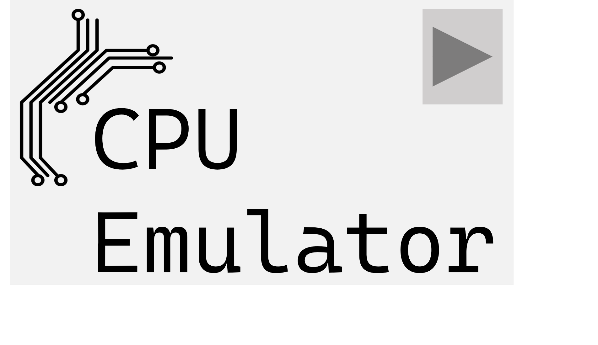

# CPU-Emulator

  

_CPU-Emulator: A Software emulation of electronic hardware_

CPU-Emulator is a simple emulator for the good old 6502 processor. The project aims to understand the low-level fundamental features of a processor. Why the 6502? Because it is simpler to work with in comparison to the modern multi-core architectures we have today. By the end of the project, it is expected to not only know the 6502 better, but also to grow in C++ knowledge.

## 📖 Table of contents

- [📖 Table of contents](#-table-of-contents)
- [🌳 Features](#-features)
- [🙇 Acknowledgements](#-acknowledgements)
- [🗺️ Roadmap](#️-roadmap)

## 🌳 Features

- 💽 6502 Instruction Set Support: The emulator must accurately execute all standard 6502 processor instructions.
- 💽 Memory Management: Implement addressable memory (RAM, ROM, registers) to simulate actual hardware behavior.
- 💽 CPU Cycle Accuracy: The emulator must simulate the timing behavior of each instruction as it would execute on the physical mirocontroller.
- 💽 Interrupt Handling: Support IRQ and NMI interrupts.

## 🗺️ Roadmap

The roadmap is tracked [here](https://github.com/daniel-akproh/CPU-Emulator/issues).

## 🙇 Acknowledgements
The idea for this project came while reading through [Obelisk's 6502 guide](https://www.nesdev.org/obelisk-6502-guide/index.html) which is a formidable resource.

